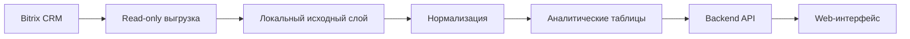

## 1. Цель

Создать внутреннюю систему аналитики продаж на основе данных Bitrix CRM.

Система должна отвечать на вопросы:

- какие контакты приносят основную выручку;
- какие ценные контакты перестали покупать;
- какие типы контактов и регионы дают лучший результат;
- как меняются ABC-сегменты;
- какие контакты являются активными, лояльными, спящими или потерянными;
- сколько времени занимает закрытие сделок;
- какие открытые сделки зависли;
- насколько выручка зависит от ограниченного числа контактов.

## 2. Основные правила

1. Bitrix используется только как источник данных в режиме чтения.
2. Из Bitrix выгружается вся доступная история без ограничения по периоду.
3. Фильтрация по датам и все расчёты выполняются в локальной базе.
4. Главная аналитическая сущность — контакт.
5. Компании в MVP не выгружаются и в аналитике не используются.
6. Выручка считается только по выигранным сделкам.
7. Расчётная прибыль всегда равна 50% выручки.
8. Все финансовые показатели приводятся к USD.
9. Сделка учитывается в аналитике контактов только один раз.
10. Названия сделок и контактов разрешено хранить и показывать.
11. Иерархия типов контактов и правила определения региона не фиксируются значениями в этом ТЗ. Они настраиваются по фактическим данным Bitrix на этапе интеграции.

## 3. Состав MVP

### Входит

- ручное обновление локальной базы из Bitrix;
- выгрузка контактов, сделок и связей между ними;
- хранение исходных и нормализованных данных;
- конвертация валют в USD;
- главный дашборд;
- ABC-анализ;
- сравнение ABC за весь период и последние 12 месяцев;
- RFM-анализ;
- список контактов для реактивации;
- аналитика по типам контактов и регионам;
- анализ цикла сделки;
- список зависших открытых сделок;
- анализ концентрации выручки;
- локальные фильтры и поиск;
- внутренняя авторизация;
- Docker-развёртывание.

### Не входит

- аналитика компаний;
- лиды;
- товары сделок;
- дела, звонки, письма и комментарии;
- телефоны, email, адреса и мессенджеры;
- запись данных обратно в Bitrix;
- Roistat;
- CSV-экспорт;
- отдельный экран качества данных;
- автоматическое обновление по расписанию;
- сложные роли доступа;
- прогнозирование и ML;
- BI-конструктор.

## 4. Архитектура



### Слои данных

| Слой | Назначение |
|---|---|
| Исходный | данные в форме, полученной из Bitrix |
| Нормализованный | связи, типы, регионы, статусы и суммы в USD |
| Аналитический | готовые расчёты и агрегаты для отчётов |

## 5. Целевой стек

**Backend:** Python 3.12, FastAPI, Pydantic v2, Polars, DuckDB, Parquet.  
**Frontend:** Next.js App Router, React, TypeScript strict, Tailwind CSS, shadcn/ui, Radix UI, lucide-react, TanStack Query/Table, React Hook Form, Zod, Zustand.  
**Testing:** pytest, Vitest, Playwright.  
**Deploy:** Docker Compose, Next standalone output, Nginx, HTTPS.

Допускается замена библиотек без изменения требований, расчётов и структуры данных.

## 6. Выгрузка из Bitrix

### 6.1. Режим работы

- используется read-only webhook или приложение с правами только на чтение CRM;
- обновление запускается вручную кнопкой `Обновить данные`;
- при каждом обновлении система получает всю доступную историю сделок и необходимые контакты;
- период не передаётся в Bitrix как фильтр;
- запросы выполняются постранично с учётом лимитов API;
- используются повторные попытки при временных ошибках;
- параллельный запуск двух обновлений запрещён.

### 6.2. Методы API

Для нормального обновления используются read-only методы со строгим списком
полей:

- `crm.deal.list` или совместимый read-only list-метод — сделки;
- `crm.contact.list` или совместимый read-only list-метод — контакты;
- `crm.status.list` — стадии и их семантика.

Связи сделок с контактами для массовой синхронизации строятся локально из
полей, уже полученных в строках сделок/контактов, например `CONTACT_ID` и
`CONTACT_IDS`, если они доступны в metadata/list responses. Массовая
синхронизация не должна выполнять отдельный `crm.deal.contact.items.get` на
каждую сделку. Любое исключительное диагностическое использование
`crm.deal.contact.items.get` требует отдельной явно согласованной задачи и не
является частью обычного обновления.

Запросы должны содержать явный список полей. `select: ["*"]` использовать запрещено.

### 6.3. Порядок обновления

1. Создать временный набор локальных таблиц.
2. Выгрузить сделки, контакты, связи и справочники стадий.
3. Получить необходимые курсы валют.
4. Нормализовать данные.
5. Пересчитать аналитические таблицы.
6. Выполнить технические проверки.
7. Сделать новый набор данных активным.

Если обновление завершилось ошибкой, предыдущий рабочий набор данных остаётся активным.

### 6.4. Статус обновления

Система хранит:

- время начала и завершения;
- статус: `не запускалось`, `выполняется`, `успешно`, `ошибка`;
- количество полученных сделок, контактов и связей;
- дату последнего успешного обновления;
- краткое описание ошибки без секретов и технического стека.

## 7. Данные из Bitrix

Точные коды пользовательских полей определяются на этапе интеграции и фиксируются в отдельной таблице соответствия в репозитории.

### 7.1. Контакт

| Поле системы | Назначение | Обязательность |
|---|---|---|
| `contact_id` | ID контакта Bitrix | обязательно |
| `contact_name` | отображаемое имя/название | обязательно |
| `contact_type_raw` | исходный тип контакта | желательно |

### 7.2. Сделка

| Поле системы | Назначение | Обязательность |
|---|---|---|
| `deal_id` | ID сделки Bitrix | обязательно |
| `deal_name` | название сделки | обязательно |
| `amount_original` | сумма в исходной валюте | обязательно |
| `currency_original` | код валюты | обязательно |
| `created_at` | дата и время создания | обязательно |
| `planned_close_at` | редактируемая плановая дата Bitrix `CLOSEDATE`; не используется в close-аналитике | необязательно |
| `actual_closed_at` | фактический UTC-момент входа в текущую финальную стадию | обязательно для текущей закрытой сделки |
| `stage_id` | стадия сделки | обязательно |
| `category_id` | ID воронки | обязательно при нескольких воронках |
| `status_group` | `won`, `open` или `lost` | расчётное |

Промежуточные даты сделки не выгружаются и не используются.

### 7.3. Связь сделки с контактом

| Поле системы | Назначение |
|---|---|
| `deal_id` | ID сделки |
| `contact_id` | ID связанного контакта |
| `is_primary` | признак основного контакта Bitrix |
| `sort_order` | порядок связи, если доступен |
| `role_id` | роль связи, если доступна |

Уникальность связи: `deal_id + contact_id`.

### 7.4. Запрещённые поля

Не выгружать:

- телефоны;
- email;
- адреса;
- мессенджеры;
- реквизиты;
- комментарии;
- файлы;
- поля активностей;
- произвольные поля, не перечисленные в утверждённом allowlist.

## 8. Контакты, типы и регионы

### 8.1. Главный контакт сделки

Все связи сделки с контактами сохраняются. Для аналитики выбирается один `analytical_contact_id`.

Порядок выбора:

1. Контакт с наиболее приоритетным типом.
2. При равном приоритете — контакт с `is_primary = true`.
3. Если равенство осталось — контакт с минимальным `contact_id`.

Сделка учитывается один раз и целиком относится к выбранному контакту. Деление суммы между контактами не выполняется.

### 8.2. Настройка типов

Справочник типов хранится в конфигурации или локальной базе и содержит:

| Поле | Назначение |
|---|---|
| `raw_value` | значение типа из Bitrix |
| `normalized_type` | нормализованное название |
| `priority` | приоритет при выборе контакта сделки |
| `region` | регион, связанный с типом |
| `is_active` | используется ли правило |

Конкретные значения типов и приоритетов определяются после анализа реальных данных Bitrix.

### 8.3. Регион

Регион определяется только через нормализованный тип контакта.

Конкретная связь `тип контакта → регион` настраивается на этапе интеграции и не зашивается в код.

Если правило отсутствует:

- `contact_type_normalized = "Не определено"` — когда не распознан тип;
- `region_normalized = "Не определено"` — когда не определён регион.

### 8.4. Сделки без контакта

- сделка сохраняется;
- общая выручка по ней учитывается;
- в отчётах по типам и регионам она попадает в группу `Не определено`;
- в контактных таблицах показывается как `Без контакта`;
- такая сделка не создаёт фиктивный контакт.

### 8.5. Историчность типа

В MVP используется текущее значение типа контакта из Bitrix. История изменения типа не восстанавливается.

## 9. Статусы сделок

Статус определяется по семантике стадии Bitrix с учётом воронки:

| Статус | Значение |
|---|---|
| `won` | выигранная сделка |
| `open` | открытая сделка |
| `lost` | проигранная сделка |

Список стадий и их семантика выгружаются из Bitrix при каждом обновлении.

Финансовые показатели, ABC и RFM рассчитываются только по `won`.

## 10. Валюты и конвертация в USD

### 10.1. Источник

Основной источник — официальный API Национального банка Республики Беларусь.

Перед реализацией необходимо проверить, что API поддерживает все валюты, которые фактически встречаются в Bitrix.

### 10.2. Дата курса

- закрытая сделка — дата `closed_at`;
- открытая сделка — дата обновления локальной базы;
- если на целевую дату курс отсутствует, используется последний доступный курс не позднее этой даты.

### 10.3. Формула

API НБРБ задаёт официальный курс в BYN за `Cur_Scale` единиц валюты.

```text
rate_byn_per_unit(currency) = Cur_OfficialRate / Cur_Scale

amount_usd =
    amount_original
    × rate_byn_per_unit(currency_original)
    ÷ rate_byn_per_unit(USD)
```

Особые случаи:

- для BYN: `rate_byn_per_unit(BYN) = 1`;
- для USD: `amount_usd = amount_original`.

### 10.4. Хранимые поля

| Поле | Назначение |
|---|---|
| `amount_original` | исходная сумма |
| `currency_original` | исходная валюта |
| `rate_date` | дата применённого курса |
| `source_rate_byn` | BYN за единицу исходной валюты |
| `usd_rate_byn` | BYN за 1 USD |
| `amount_usd` | сумма в USD |
| `rate_source` | `NBRB` |
| `rate_fetched_at` | дата получения курса |

Курсы кэшируются в локальной базе.

Если для выигранной сделки невозможно получить курс, новый набор аналитики не активируется. Вторичный источник курса подключается только после отдельного согласования.

## 11. Финансовые и операционные метрики

| Метрика | Формула |
|---|---|
| Выручка | сумма `amount_usd` выигранных сделок |
| Расчётная прибыль | `revenue_usd × 0.50` |
| Количество сделок | число выигранных сделок |
| Средний чек | `revenue_usd / won_deals_count` |
| Цикл сделки | `actual_closed_at - created_at` |
| Средний цикл | среднее число дней по выигранным сделкам |
| Медианный цикл | медиана числа дней |
| P75 / P90 | 75-й и 90-й перцентили цикла |
| Дней открыта | `analysis_date - created_at` |
| Повторный контакт | контакт с двумя и более выигранными сделками |
| Доля повторных | повторные контакты / контакты с покупками |
| Концентрация | доля выручки топ-5, топ-10 и топ-20 контактов |

Правила:

- выручка относится к периоду по `actual_closed_at`;
- отрицательные суммы не ожидаются;
- сделка с отрицательной суммой или циклом меньше нуля не участвует в расчётах и фиксируется в техническом журнале;
- из-за фиксированной маржи 50% ABC и RFM строятся по выручке: сегментация по прибыли дала бы тот же результат.

## 12. Периоды

Bitrix всегда выгружается целиком. Периоды применяются только к локальной базе.

### Обязательные варианты

- весь период;
- последние 12 календарных месяцев;
- произвольный период `date_from — date_to`.

### Правила

- `analysis_date` по умолчанию равна текущей дате в часовом поясе системы;
- для произвольного периода `analysis_date = date_to`;
- весь период начинается с самой ранней выигранной сделки;
- финансовые отчёты фильтруются по `actual_closed_at`;
- отчёт по открытым сделкам фильтруется по `created_at`;
- границы периода включаются полностью.

## 13. ABC-анализ

### 13.1. Основа

ABC строится по контактам на основании выручки в USD по выигранным сделкам.

Обязательные расчёты:

1. ABC за весь период.
2. ABC за последние 12 месяцев.
3. Сравнение сегментов между этими периодами.

### 13.2. Алгоритм

1. Суммировать выручку по контакту.
2. Отсортировать по выручке по убыванию.
3. При равной выручке сортировать по `contact_id`.
4. Рассчитать долю и накопленную долю.
5. Присвоить сегмент:

| Сегмент | Правило |
|---|---|
| A | накопленная доля до текущей строки меньше 80% |
| B | накопленная доля до текущей строки от 80% до 95% |
| C | накопленная доля до текущей строки от 95% |

Текущая строка включается в сегмент, который доводит накопленную долю до соответствующей границы. Поэтому крупнейший контакт всегда относится к A.

### 13.3. Нет продаж

Если у контакта были выигранные сделки за весь период, но не было выигранных сделок за последние 12 месяцев, его текущий сегмент:

```text
Нет продаж
```

Обозначение `0` не используется.

### 13.4. Миграция ABC

| Переход | Приоритет |
|---|---|
| A → Нет продаж | срочно |
| A → C | срочно |
| A → B | важно |
| B → Нет продаж | важно |
| B → C | наблюдать |
| B/C → A | развивать |
| Новый контакт в A | закрепить |

Сравнение всего периода и последних 12 месяцев используется для миграции сегментов. Процент роста между этими двумя периодами не рассчитывается, так как периоды имеют разную длительность.

## 14. RFM-анализ

### 14.1. Основа

RFM строится по контактам и только по выигранным сделкам.

| Показатель | Расчёт |
|---|---|
| Recency | дней от `analysis_date` до последней выигранной сделки |
| Frequency | количество выигранных сделок за выбранный период |
| Monetary | выручка в USD за выбранный период |

Период выбирается в локальной базе. Значение по умолчанию — весь период.

### 14.2. Баллы

Для R, F и M используются квинтили и баллы от 1 до 5:

- R: чем меньше дней, тем выше балл;
- F: чем больше сделок, тем выше балл;
- M: чем больше выручка, тем выше балл;
- одинаковые значения получают одинаковый балл, даже если размеры групп отличаются.

Результат хранится как:

- `r_score`;
- `f_score`;
- `m_score`;
- `rfm_code`, например `545`.

### 14.3. Сегменты

Правила применяются сверху вниз:

| Сегмент | Условие |
|---|---|
| Лучшие | `R ≥ 4`, `F ≥ 4`, `M ≥ 4` |
| Ценные под риском | `R ≤ 2` и (`F ≥ 4` или `M ≥ 4`) |
| Новые | одна сделка и `R ≥ 4` |
| Лояльные | `R ≥ 3` и `F ≥ 3` |
| Одноразовые | одна сделка |
| Остальные | все прочие |

Контакты без выигранных сделок в выбранном периоде не входят в RFM этого периода. Для поиска таких контактов используется отчёт миграции ABC и экран реактивации.

## 15. Отчёты MVP

### 15.1. Обзор

Показывает:

- выручку;
- расчётную прибыль;
- количество выигранных сделок;
- средний чек;
- средний и медианный цикл;
- долю повторных контактов;
- концентрацию выручки топ-5/10/20;
- динамику выручки по месяцам;
- топ-10 контактов;
- число контактов, требующих реактивации.

### 15.2. Реактивация

Основная таблица:

| Поле |
|---|
| приоритет |
| контакт |
| тип контакта |
| регион |
| ABC за весь период |
| ABC за последние 12 месяцев |
| выручка за весь период |
| выручка за последние 12 месяцев |
| последняя выигранная сделка |
| дней без покупки |
| количество выигранных сделок |
| рекомендация |

### 15.3. Контакты

Вкладки:

- ABC;
- RFM;
- повторность;
- список всех контактов с агрегированными показателями.

Основные поля:

- контакт;
- тип;
- регион;
- выручка;
- расчётная прибыль;
- количество сделок;
- средний чек;
- дата последней сделки;
- ABC;
- RFM;
- дней без покупки.

### 15.4. Типы и регионы

Матрица:

| Регион | Тип контакта | Выручка | Прибыль | Сделки | Контакты | Средний чек | Медианный цикл | Повторность |
|---|---|---:|---:|---:|---:|---:|---:|---:|

### 15.5. Сделки

Вкладки:

- цикл сделки;
- открытые и зависшие сделки.

Метрики цикла:

- среднее;
- медиана;
- P75;
- P90;
- разбивка по типу контакта;
- разбивка по региону;
- разбивка по диапазону суммы.

Открытая сделка считается зависшей, если:

```text
days_open > P75 цикла выигранных сделок того же типа контакта
```

Если для типа недостаточно данных, используется общий P75.

Таблица зависших сделок:

- `deal_id`;
- название сделки;
- контакт;
- тип;
- регион;
- дата создания;
- дней открыта;
- порог;
- превышение;
- сумма в исходной валюте;
- сумма в USD.

### 15.6. Обновление данных

Экран содержит:

- кнопку `Обновить данные`;
- текущий статус;
- дату последнего успешного обновления;
- длительность;
- количество сделок, контактов и связей;
- понятное сообщение об ошибке.

Отдельный экран качества данных не создаётся.

## 16. Фильтры и таблицы

### Глобальные фильтры

- период;
- тип контакта;
- регион;
- статус сделки — только на экранах, где это применимо.

### Таблицы

- сортировка;
- поиск по названию контакта или сделки;
- фильтрация;
- серверная пагинация;
- фиксированный формат чисел и дат;
- пустые нормализованные значения показываются как `Не определено`.

Форматы:

- суммы: два знака после запятой, валюта USD;
- проценты: один знак после запятой;
- дни: целое число;
- даты: `ДД.ММ.ГГГГ`.

CSV-экспорт и иные выгрузки из интерфейса в MVP отсутствуют.

## 17. Backend API

| Метод | URL | Назначение |
|---|---|---|
| `POST` | `/api/sync/run` | запустить обновление из Bitrix |
| `GET` | `/api/sync/status` | получить статус обновления |
| `GET` | `/api/meta/filters` | доступные типы, регионы и периоды |
| `GET` | `/api/dashboard/overview` | главный дашборд |
| `GET` | `/api/reports/abc` | ABC за выбранный период |
| `GET` | `/api/reports/abc-migration` | весь период против последних 12 месяцев |
| `GET` | `/api/reports/rfm` | RFM |
| `GET` | `/api/reports/reactivation` | контакты для реактивации |
| `GET` | `/api/reports/contacts` | агрегаты по контактам |
| `GET` | `/api/reports/types-regions` | типы и регионы |
| `GET` | `/api/reports/deal-cycle` | цикл сделки |
| `GET` | `/api/reports/stale-deals` | зависшие сделки |
| `GET` | `/api/reports/concentration` | концентрация выручки |

Параметры отчётов:

```text
date_from
date_to
contact_type
region
status
search
sort
order
page
page_size
```

Все параметры применяются к локальной базе. API отчётов не должен запускать запросы к Bitrix.

## 18. Интерфейс

### 18.1. Навигация

- Обзор;
- Реактивация;
- Контакты;
- Типы и регионы;
- Сделки;
- Обновление данных.

### 18.2. Требования

- основной сценарий — десктоп от 1366 px;
- интерфейс плотный, спокойный и табличный;
- графики используются только для динамики и сравнения;
- ключевые действия доступны без обучения;
- на узких экранах таблицы используют горизонтальную прокрутку;
- фильтры сохраняются при переходах между отчётами в рамках сессии.

## 19. Дизайн-система

Дизайн-система создаётся и утверждается до начала разработки frontend.

Она хранится в репозитории на одном уровне с документацией:

```text
docs/
design-system/
backend/
frontend/
```

Обязательный состав:

- дизайн-токены;
- типографика;
- сетка и отступы;
- цвета состояний;
- кнопки;
- поля и селекты;
- выбор периода;
- таблицы;
- карточки метрик;
- бейджи ABC/RFM/статусов;
- контейнеры графиков;
- состояния загрузки, ошибки и отсутствия данных;
- Storybook или аналогичная документация компонентов.

Frontend должен использовать компоненты и токены дизайн-системы. Создание отдельных несогласованных стилей внутри экранов запрещено.

## 20. Безопасность

- Bitrix webhook хранится только в переменных окружения;
- доступ к Bitrix — только на чтение;
- приложение доступно по HTTPS;
- вход по логину и паролю;
- исходные данные и база не попадают в git;
- секреты не выводятся в API, интерфейс и журналы;
- выполняется резервное копирование локальной базы;
- хранение времени — UTC;
- отображение времени — настраиваемый часовой пояс, по умолчанию `Europe/Minsk`.

## 21. Технические требования

- обновление данных идемпотентно;
- одновременно выполняется не более одного обновления;
- ошибка обновления не повреждает текущую аналитику;
- чтение отчётов доступно во время обновления;
- расчёты выполняются воспроизводимо на одинаковом наборе данных;
- все нормализационные правила версионируются вместе с кодом или конфигурацией;
- API возвращает понятные пользовательские ошибки без внутреннего стека;
- приложение запускается одной командой через Docker Compose.

## 22. Тестирование

### Unit-тесты

Обязательно покрыть:

- выбор главного контакта сделки;
- равные приоритеты контактов;
- сделки без контакта;
- нормализацию типа и региона;
- определение статуса сделки;
- конвертацию каждой используемой валюты в USD;
- выбор исторического курса;
- расчёт выручки и прибыли;
- цикл сделки;
- ABC и граничные значения 80/95%;
- статус `Нет продаж`;
- миграцию ABC;
- RFM-баллы и сегменты;
- зависшие сделки;
- концентрацию выручки.

### Интеграционная фикстура

Минимальный набор:

- не менее 10 контактов;
- не менее 30 сделок;
- выигранные, открытые и проигранные сделки;
- несколько валют;
- сделка с несколькими контактами;
- равные приоритеты типов;
- сделка без контакта;
- контакт A без продаж за последние 12 месяцев;
- контакт с одной сделкой;
- длинная открытая сделка.

Проверяется цепочка:

```text
данные Bitrix → локальный слой → нормализация → аналитика → API
```

## 23. Критерии приёмки MVP

MVP принят, если:

1. Обновление запускается из интерфейса.
2. Из Bitrix загружается вся доступная история без фильтра периода.
3. В локальной базе есть контакты, сделки и все их связи.
4. Запрещённые персональные поля не запрашиваются и не хранятся.
5. Сделка с несколькими контактами учитывается ровно один раз.
6. Тип и регион определяются через настраиваемый справочник.
7. Все выигранные сделки корректно приведены к USD.
8. Выручка и прибыль 50% совпадают с контрольным расчётом.
9. ABC рассчитан за весь период и последние 12 месяцев.
10. Контакты без продаж за последние 12 месяцев имеют статус `Нет продаж`.
11. Работают миграция ABC и экран реактивации.
12. Работает RFM с баллами 1–5.
13. Работают отчёты по типам и регионам.
14. Рассчитываются средний, медианный, P75 и P90 цикла сделки.
15. Определяются зависшие открытые сделки.
16. Все фильтры выполняются по локальной базе без обращения к Bitrix.
17. Ошибка обновления не удаляет предыдущие рабочие данные.
18. Интерфейс использует утверждённую дизайн-систему.
19. В интерфейсе нет аналитики компаний, CSV-экспорта и отдельного экрана качества данных.

## 24. Порядок разработки

### Этап 0. Документация и дизайн-система

- утвердить это ТЗ;
- подготовить дизайн-токены и базовые компоненты;
- оформить Storybook или аналог;
- создать карту экранов.

### Этап 1. Репозиторий и тестовые данные

- создать структуру проекта;
- настроить Docker Compose;
- создать модели данных;
- подготовить интеграционную фикстуру;
- настроить тесты.

### Этап 2. Интеграция с Bitrix и НБРБ

- подключить read-only доступ;
- определить реальные коды полей;
- выгрузить полную историю;
- реализовать связи сделок и контактов;
- реализовать курсы и конвертацию.

### Этап 3. Нормализация и аналитика

- настроить типы, приоритеты и регионы;
- реализовать финансовые показатели;
- реализовать ABC, миграцию и RFM;
- реализовать цикл, зависшие сделки и концентрацию;
- открыть report API.

### Этап 4. Frontend

- подключить утверждённую дизайн-систему;
- реализовать экраны;
- подключить фильтры, таблицы и графики;
- реализовать экран обновления.

### Этап 5. Приёмка и деплой

- сверить результаты с контрольной выборкой Bitrix;
- выполнить тесты;
- настроить HTTPS и резервное копирование;
- развернуть на VPS.

## 25. Конфигурация, уточняемая на этапе интеграции

Следующие значения намеренно не фиксируются в этом ТЗ:

- код поля типа контакта в Bitrix;
- фактический список типов;
- приоритет типов;
- соответствие типов регионам;
- список воронок и стадий;
- набор валют в реальных сделках.

Эти значения заполняются после анализа Bitrix и фиксируются в конфигурации проекта до приёмки на реальных данных.

## 26. Официальные технические источники

- Bitrix24 REST API: `https://apidocs.bitrix24.com/`
- НБРБ, API официальных курсов: `https://www.nbrb.by/apihelp/exrates`

## 27. Воронки и метрики

Все отчёты локально фильтруют сделки по числовому `category_id` и inclusive
дате создания. ABC и КЭВ применяют даты создания только после явного действия
`Применить даты создания`; эти даты независимы от периода закрытия. Средний чек
равен won USD выручке / числу won сделок, а средний цикл считается по валидным
закрытым won/lost сделкам. Итоги таблиц относятся ко всей выборке до пагинации.
